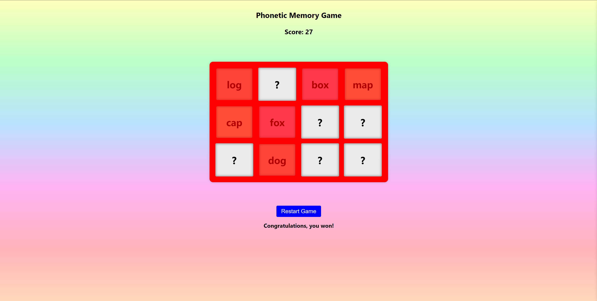
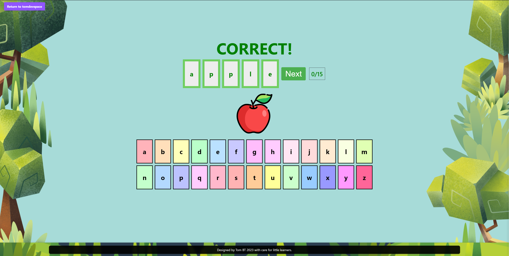

Hello, this is my word games repo I have broken them up into smaller repos per game in the past. Then I decided to try bring them all together in one. They do have there own Readme files but I decided to add them here as well.

# Phonics Memory Game

## Description

"Phonics Memory Game" blends the thrill of memory games with the intricacies of phonetic spellings. Written in JavaScript, this game promises not just fun, but a genuine enhancement of linguistic skills.

### The Challenge

**Phonics Memory Game** - Players are challenged to match the phonetic spelling of a word with another word that echoes a similar sound. For instance, "fog" and "log" might be a pair. As players proceed, the memory challenges increase, offering a compelling gameplay experience.

### Game Philosophy

Through sight, sound, and the essence of memorization, "Phonics Memory Game" aims to make learning phonetics an enjoyable endeavor. With every match, players not only score points but also reinforce their phonetic understanding.

# Word Constructor

live link : [Word Constructor](https://word-constructor.netlify.app/)

## Description

"Word Constructor" is an interactive word puzzle game, crafted meticulously in JavaScript to offer users a unique way to reinforce their spelling abilities.

### Gameplay

**Word Constructor** - Dive deep into a game where players need to align the phonetic sound of a word with its correct spelling. The challenge? Dragging the letters into their rightful position on a grid of awaiting boxes. If I managed to add more levels, the difficulty should gradually ramps up, ensuring users are constantly on their toes.

### Why Word Constructor?

Drawing inspiration from the age-old challenge of phonetic spellings, "Word Constructor" aims to bridge the gap between how a word sounds and how it's written, providing a holistic learning experience.

